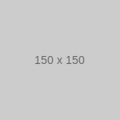

# Sample Document

This is a sample markdown document that demonstrates various GitHub-flavored markdown features supported by the md-to-pdf converter.

## Text Formatting

Here are some examples of text formatting:

- **Bold text** and *italic text*
- ***Bold and italic*** together
- ~~Strikethrough text~~
- `Inline code` formatting

## Lists

### Unordered List
- First item
- Second item
  - Nested item 1
  - Nested item 2
- Third item

### Ordered List
1. First step
2. Second step
   1. Sub-step A
   2. Sub-step B
3. Third step

## Code Blocks

Here's a JavaScript code block:

```javascript
function greet(name) {
    console.log(`Hello, ${name}!`);
    return true;
}

// Call the function
greet("World");
```

Python example:

```python
def calculate_sum(numbers):
    return sum(numbers)

# Example usage
numbers = [1, 2, 3, 4, 5]
total = calculate_sum(numbers)
print(f"Sum: {total}")
```

## Tables

| Feature | Support | Notes |
|---------|---------|-------|
| Tables | ✅ | Supports alignment |
| Lists | ✅ | Nested lists work |
| Code blocks | ✅ | Syntax highlighting |
| Images | ✅ | Local and remote |

## Blockquotes

> This is a blockquote
> It can span multiple lines
>
> And have multiple paragraphs

## Task Lists

- [x] Write sample markdown
- [x] Include various features
- [ ] Convert to PDF
- [ ] Review output

## Links

- [Visit GitHub](https://github.com)
- [Read the Documentation](../README.md)
- [Check Development Notes](../DEVELOPMENT.md)

## Horizontal Rule

---

## Images

Images can be included from the web or local files. Here are different examples:

### SVG Example (Local)


### PNG Example (Local)


### Web Image Example


## Mathematical Expressions

When supported by your markdown processor:

Inline math: $E = mc^2$

Block math:

$$
\frac{n!}{k!(n-k)!} = \binom{n}{k}
$$

## Footnotes

Here's a sentence with a footnote[^1].

[^1]: This is the footnote content.

## Final Notes

This document demonstrates the key features supported by the md-to-pdf converter. You can use this as a test file to verify:

1. Styling consistency
2. Page breaks
3. Font rendering
4. Image handling
5. Overall formatting
